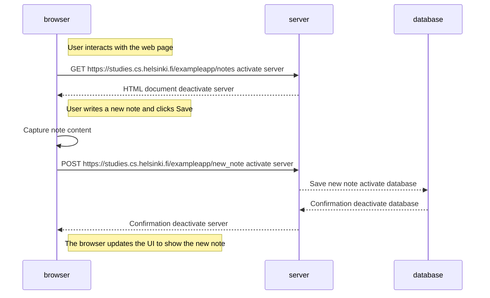

```mermaid

sequenceDiagram

participant browser
participant server
participant database

Note right of browser: User interacts with the web page

browser->>server: GET https://studies.cs.helsinki.fi/exampleapp/notes activate server 
server-->>browser: HTML document deactivate server 

Note right of browser: User writes a new note and clicks Save 

browser->>browser: Capture note content 
browser->>server: POST https://studies.cs.helsinki.fi/exampleapp/new_note activate server 
server-->>database: Save new note activate database 
database-->>server: Confirmation deactivate database 
server-->>browser: Confirmation deactivate server 

Note right of browser: The browser updates the UI to show the new note
```
