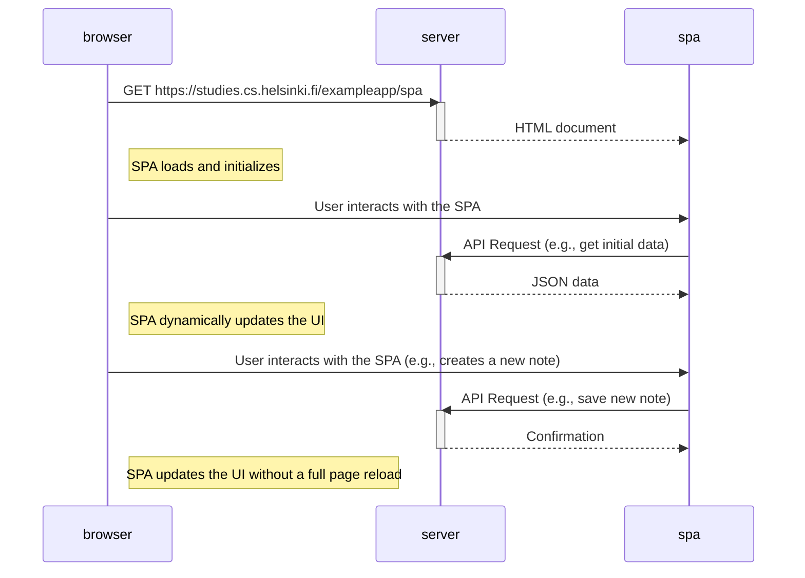

```mermaid

sequenceDiagram

    participant browser
    participant server
    participant spa

    browser->>server: GET https://studies.cs.helsinki.fi/exampleapp/spa
    activate server
    server-->>spa: HTML document
    deactivate server

    Note right of browser: SPA loads and initializes

    browser->>spa: User interacts with the SPA
    spa->>server: API Request (e.g., get initial data)
    activate server
    server-->>spa: JSON data
    deactivate server

    Note right of browser: SPA dynamically updates the UI

    browser->>spa: User interacts with the SPA (e.g., creates a new note)
    spa->>server: API Request (e.g., save new note)
    activate server
    server-->>spa: Confirmation
    deactivate server

    Note right of browser: SPA updates the UI without a full page reload
```
