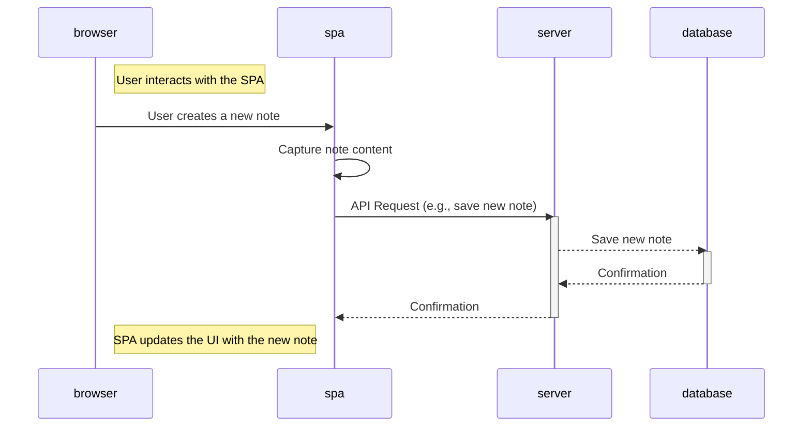

```mermaid

sequenceDiagram
    participant browser
    participant spa
    participant server
    participant database

    Note right of browser: User interacts with the SPA

    browser->>spa: User creates a new note
    spa->>spa: Capture note content
    spa->>server: API Request (e.g., save new note)
    activate server
    server-->>database: Save new note
    activate database
    database-->>server: Confirmation
    deactivate database
    server-->>spa: Confirmation
    deactivate server

    Note right of browser: SPA updates the UI with the new note
```
